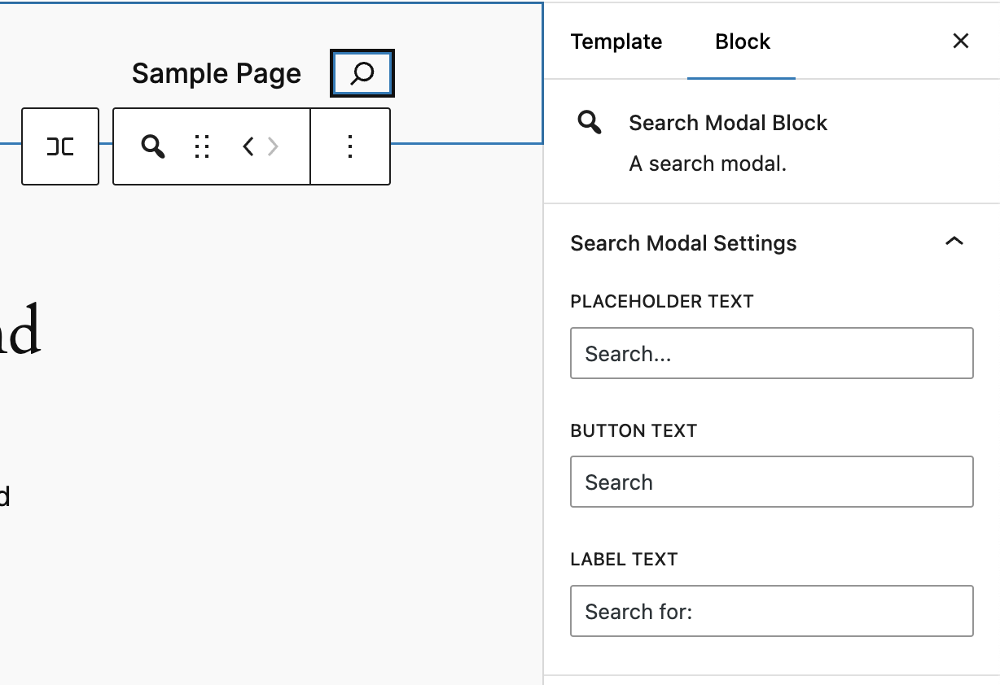
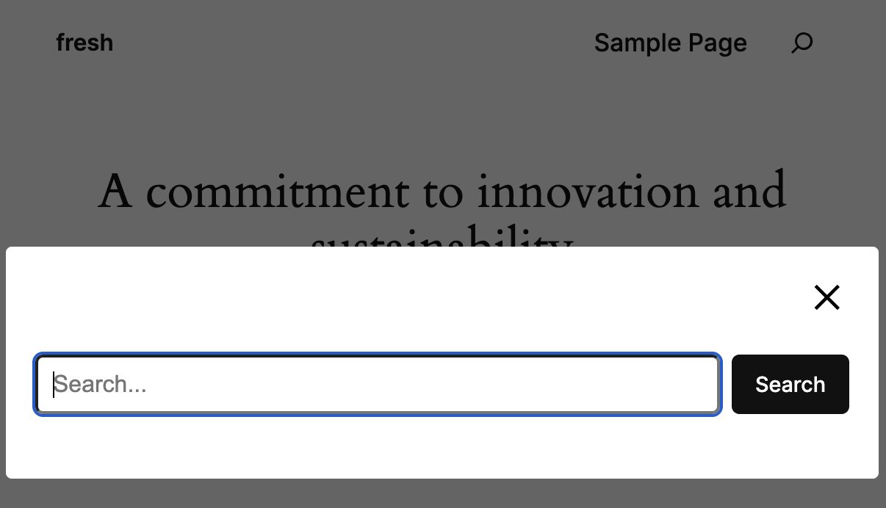

# Search Modal Block

A search modal block for WordPress.

## Description

The Search Modal Block adds a search modal to your WordPress site.

## Installation

1. Download the plugin as a zip file.
2. In your WordPress admin panel, go to Plugins > Add New.
3. Click the "Upload Plugin" button at the top of the page.
4. Choose the downloaded zip file and click "Install Now".
5. Once installed, click "Activate" to enable the plugin.

## Screenshots

### Block Settings in the Editor

### Search Modal on the Frontend

## Credits

This plugin uses the following third-party libraries:

- [MicroModal](https://micromodal.vercel.app/) - A lightweight, configurable modal library for web applications.
